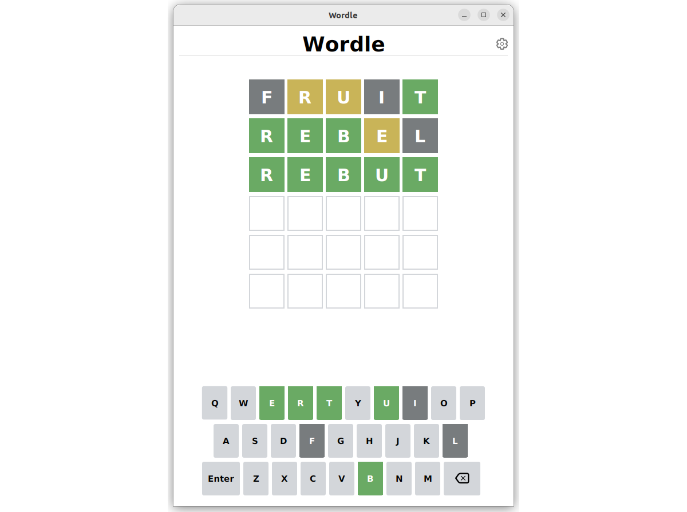

## Test d'IHM et langage Java

### Test du jeudi 9 juin 2022 – Durée 2 heures – Documents autorisés

L'objectif de cet exercice est la programmation d'une version JavaFx du jeu **Wordle**.

**Wordle** est un jeu de lettres en ligne gratuit développé en 2021 par Josh Wardle. Ce jeu est une adaptation directe
du jeu télévisé américain Lingo (Motus en France) qui propose de faire deviner un mot par plusieurs tentatives, en
indiquant pour chacune d'entre-elles la position des lettres bien placées et mal placées. Par sa popularité sur Twitter,
Wordle rencontre un succès immédiat dans sa version en anglais. Il est rapidement proposé dans d’autres langues et imité
dans d'autres versions. L'originalité du jeu tient dans le fait qu'une seule énigme commune à tous les joueurs est
proposée chaque journée.


### Description du jeu

Le but du jeu est de deviner un mot spécifique de cinq lettres en un maximum de six tentatives, en tapant des lettres
sur un écran de six lignes de cinq cases chacune. La personne qui joue inscrit sur la première ligne un mot de cinq
lettres de son choix et entre sa proposition. Après chaque proposition, les lettres apparaissent en couleurs : le fond
gris représente les lettres qui ne se trouvent pas dans le mot recherché, le fond jaune représente les lettres qui se
trouvent ailleurs dans le mot, et le fond vert représente les lettres qui se trouvent à la bonne place dans le mot à
trouver. Un seul mot est proposé par jour. Il est possible de copier dans le presse-papier la grille jouée (positions
des lettres bien placées et mal placées) afin de la partager.

L'IHM que vous allez en partie réaliser ressemblera à la fenêtre suivante :



### Travail à réaliser

L'objectif de ce test est d'évaluer votre capacité à écrire une IHM à l'aide du langage Java, les méthodes complexes car
trop algorithmiques n'auront pas à être implémentées. Vous pourrez retrouver une proposition de correction à l'adresse
suivante :
<https://github.com/IUTInfoAix-R202/TestIHM2022/>

L'application définit plusieurs types d'objets :

- Un objet `WordleMain` est une application JavaFX permettant de jouer.
- Un objet `WordleView` est la racine de la scène de jeu (l'intérieur de la fenêtre de l'image).
- Un objet `WordleController` est la classe contrôleur de l'IHM décrite par `WordleView`.
- Un objet `VirtualKeyboard` est le clavier virtuel que l'on voit en bas de la fenêtre principale.
- Un objet `WordleTiles` est la grille principale composée de 6 lignes de mot.
- Un objet `WordleRow` est le composant permettant de saisir un mot de 5 lettres.
- Un objet `LetterBox` est un élément de la grille principale.
- Un objet `LetterModel` est l'objet qui permet de materialiser l'état d'une case de jeu.
- Un objet `WordleData` est l'objet qui charge le dictionnaire et fournit les fonctionnalités *"métier"* (voir ci-dessous).

Votre travail dans la suite de ce sujet sera d'écrire pas à pas plusieurs des classes ci-dessus.

Le code des classes `WordleData` et `LetterModel` vous est donné à titre d'information ci-dessous, pour que vous
puissiez vous y référer si besoin au cours des exercices.

### La classe `WordleData`

La classe `WordleData`, s'occupe de charger le dictionnaire et de mettre à disposition l'ensemble des fonctionnalités *"
métiers"* à l'IHM. Vous reconnaitrez certainement des méthodes que vous avez écrits durant l'examen de R2.03.

```java
public class WordleData {
    List<String> solutions =
            new BufferedReader(new InputStreamReader(Objects.requireNonNull(getClass().getResourceAsStream("/data/solutions.txt")))).lines().toList();
    Dictionary dictionary =
            new Dictionary(new BufferedReader(new InputStreamReader(Objects.requireNonNull(getClass().getResourceAsStream("/data/dictionary.txt")))).lines().map(Word::new).toArray(Word[]::new));

    public WordleData() {
    }

    public Word getWordOfTheDay() {
        int indexOfTheDay = Long.valueOf(LocalDate.of(2022, 6, 5).until(LocalDate.now(), ChronoUnit.DAYS)).intValue();
        String solutionOfTheDay = solutions.get(indexOfTheDay);
        return new Word(solutionOfTheDay);
    }

    List<Integer> getCorrectPosition(List<Character> characters) {
        Word guess = new Word(characters);
        return guess.matchesCorrectPositionWith(getWordOfTheDay());
    }

    List<Integer> getIncorrectPosition(List<Character> characters) {
        Word guess = new Word(characters);
        return guess.matchesIncorrectPositionWith(getWordOfTheDay());
    }

    List<Integer> getWrongLetterPosition(List<Character> characters) {
        Word guess = new Word(characters);
        return guess.matchesWrongLetterPositionWith(getWordOfTheDay());
    }

    public boolean isWordValid(List<Character> characters) {
        return dictionary.includesWord(new Word(characters));
    }
}
```

### La classe `LetterModel`

Cette classe contient l'état d'une case. Servira de référence aux bindings permettant de garder l'IHM synchronisée.

```java
public class LetterModel {
    int column;
    ObjectProperty<Character> letter = new SimpleObjectProperty<>();
    ObjectProperty<LetterStatus> status = new SimpleObjectProperty<>();

    public LetterModel(int column) {
        this.column = column;
        clear();
    }

    void clear() {
        letter.set(' ');
        status.set(LetterStatus.EMPTY);
    }
}
```

### Exercice 1 - Implémentation de la classe `LetterBox`

La grille de jeu sera constituée de 6 lignes permettant de contenir 5 lettres.

1. Écrire la déclaration d'une classe publique `LetterBox`, sous-classe de (étendant) `StackPane`, réduite pour le
   moment à la déclaration de ses variables d'instance :

    - `label` de type `Label`, qui permettra d'afficher la lettre contenue dans la case.

    - `letterModel` de type `LetterModel` qui permettra de connaître l'état de la case.

2. Écrire les accesseurs publics `getLabel()`, `getLetterModel()` qui renvoient la donnée membre correspondante.

3. Écrire la méthode `void creerBinding()` qui s'occupe de lier le texte du label avec la lettre contenue
   dans `letterModel`. Ne pas oublier de transformer la lettre en un objet `String`.

4. Écrire la méthode `void ajouterListener` qui ajoute un écouteur d'invalidation sur la propriété `letterModel.status`.
   Cet écouteur appellera la méthode `LetterStatus.updatePseudoClass(Node, LetterStatus)` en lui passant en paramètre la
   case courante ainsi que son état.

5. Écrire la méthode `void réglerStyle` qui va régler les classes CSS des différents éléments graphiques. Pour ce faire
   vous devrez utiliser la méthode `getStyleClass()` qui retourne la liste des classes CSS associée au nœud. Pour
   votre objet `this` ajoutez lui la classe `"tile-box"` et pour le label la classe `"tile-letter"`.

6. Écrire la déclaration de la classe CSS `.tile-box` pour que les cases aient une hauteur et une largeur minimale de
   62px ainsi qu'une bordure de 2px.

7. Écrire le constructeur public `LetterBox(LetterModel letterModel)` qui :
    - Assigne la donnée membre au paramètre correspondant.

    - Initialise les autres données membres.

    - Active les liaisons entre propriétés en appelant la méthode adequate.

    - Règle les styles convenablement.

    - Ajoute les écouteurs comme il se doit.

### Exercice 2 - Implémentation de la classe `WordleRow`

Cette classe est celle qui permet de gérer les mots saisis par l'utilisateur. Elle permet grâce à un ensemble de
propriétés d'afficher pour chaque proposition les lettres en fonction de leur statut.

1. Écrire la classe `WordleRow` qui dérive de `HBox`. Cette classe aura les données membres privées suivantes :

    - `letterBoxes` est un tableau de cases qui permet d'afficher les lettres contenues dans le mot courant.

    - `letters` est un tableau de modèles de lettres (classe `LetterModel`) qui conservera l'état de chaque lettre.

    - Une propriété booléenne `wordValidity` qui permettra de savoir si le mot actuellement dans la ligne est valide (*i.e* de longueur 5 et présent dans le dictionnaire).
      
    - Une propriété entière `currentColumn` qui mémorisera l'emplacement de la prochaine lettre à saisir.
    
2. Écrire la méthode `creerBindings()` qui s'occupe de créer les différents bindings nécessaires. Pour déterminer la
   validité d'un mot, supposez que vous disposez de la méthode
   statique `boolean WordleData.isWordValid(LetterModel[] letters)`. La création du binding peut se faire en utilisant
   la méthode `Bindings.createBooleanBinding()` qui prend en premier paramètre une expression lambda (sans paramètre) retournant une valeur booléenne et en arguments suivants, la ou les propriétés utilisées dans la lambda.
3. Écrire la méthode `remplir()` qui s'occupe de remplir les tableaux `letters` et `letterBoxes`.
4. Écrire la méthode `ajouterListener()` qui ajoute un écouteur d'invalidation sur la propriété `wordValidity` qui
   change la couleur de fond en gris si le dernier mot saisi n'était pas valide.
5. Écrire le constructeur `WordleRow()` qui initialise toutes les données membres et appelle les
   méthodes `creerBindings()`, `remplir()` et  `ajouterListener()`.

### Exercice 3 - Implémentation du clavier virtuel

Le clavier visuel permet à l'utilisateur de saisir les lettres dans la grille, de valider sa saisie et de corriger si
nécessaire. Ce composant est l'élément principal de l'interaction avec l'utilisateur. Il faut en plus de sa capacité à
capturer les saisies qu'il puisse être lié avec l'object `WordleRow` courant.

Le clavier virtuel sera constitué de 3 lignes. La dernière contiendra une touche `"Enter"` et une touche `"Backspace"`.
Chacune des touches devra réagir au click pour enregistrer une saisie.

1. Écrire la déclaration d'une classe publique `VirtualKeyboard`, sous-classe de (étendant) `VBox`, réduite pour le
   moment à la déclaration de ses variables d'instance :
    - `keystrokeConsumer` de type `Consumer<Character>` qui permet de mémoriser une expression lambda qui prend en
      paramètre un caractère. Cette lambda sera utilisée pour récupérer la saisie de l'utilisateur.

    - `enterHandler` de type `Runnable`. Elle permettra de mémoriser l'expression lambda sans argument qui sera appelée
      lorsque l'utilisateur actionnera la touche `"Enter"`.

    - `backspaceHandler` de type `Runnable`. Elle permettra de mémoriser l'expression lambda sans argument qui sera
      appelée lorsque l'utilisateur actionnera la touche `"Backspace"`.

    - `alphabet` de type `Map<Character, ObjectProperty<LetterStatus>>` est un conteneur associatif qui mémorisera à
      chaque instant le status de chaque lettre de l'alphabet. Cet objet sera utilisé pour modifier la couleur des
      touches du clavier au fur et à mesure des essais de l'utilisateur.

2. Écrire la méthode `Button createButton(String text)` qui s'occupe de créer un objet `Button`; de lui donner pour
   texte la chaine `text`; fait en sorte que la largeur minimum du bouton soit 44.0 et la hauteur, 58.0; que la classe
   CSS associée soit `"key-button"`.
3. Écrire la méthode `Button createLetterButton(char letter)` qui va créer une touche de clavier normale. Créer un
   bouton en utilisant `createButton` avec la lettre comme texte. Ajouter un écouteur de clic souris avec la
   méthode `button.setOnMouseClicked` en lui passant en paramètre la donnée membre voulue.
4. De même, écrire les méthodes `Button createBackspaceKey()` et `Button createEnterKey()` qui s'occupent de créer les
   touches `"Enter"` et `"Backspace"`.
5. Écrire la
   méthode `HBox createRow(List<Character> letters, double leftPadding, boolean includeEnter, boolean includeBackspace)`
   qui s'occupe de créer une ligne du clavier en utilisant les méthodes précédemment écrites. Ajouter un espacement à
   gauche de `letfPadding` (penser à `setPadding` et à la classe `Insets`).
6. Écrire le
   constructeur `VirtualKeyboard(Consumer<Character> keystrokeConsumer, Runnable enterHandler, Runnable backspaceHandler, Map<Character, ObjectProperty<LetterStatus>> alphabet)` qui s'occupe d'initialiser les données membres et de créer les trois lignes du clavier avant de les ajouter à la
   liste des enfants de la classe (avec `getChildren()` et `addAll()`). Vous supposerez disposer des données membres
   suivantes :

```java
   List<Character> row1Keys=List.of('Q','W','E','R','T','Y','U','I','O','P');
        List<Character> row2Keys=List.of('A','S','D','F','G','H','J','K','L');
        List<Character> row3Keys=List.of('Z','X','C','V','B','N','M');
```

### Exercice 4 - Implémentation de la classe `WordleMain`

La classe `WordleMain` est le programme principal de notre application. C'est elle qui a la responsabilité de charger la
vue principale et de l'ajouter à la scène.

1. Écrivez une méthode `main` aussi réduite que possible pour lancer l’exécution de tout cela.


2. Écrire la méthode `public void start(Stage primaryStage)`. Elle devra :
    - Modifier le titre de la fenêtre en "Wordle".

    - Créer un objet `loader` du type `FXMLLoader` et charger la `VBox` principale à partir du fichier `WordleView.fxml`.

    - Récupérer le contrôleur du type `WordleController` avec la méthode `getController()` du `loader`.

    - Appeler la méthode `setStageAndSetupListeners()` de la classe `WordleController` qui rajoutera l'écouteur
      d’événement de fermeture de la fenêtre principale.

    - Ajouter la `VBox` comme racine du graphe de scène.

    - Rendre visible le stage.