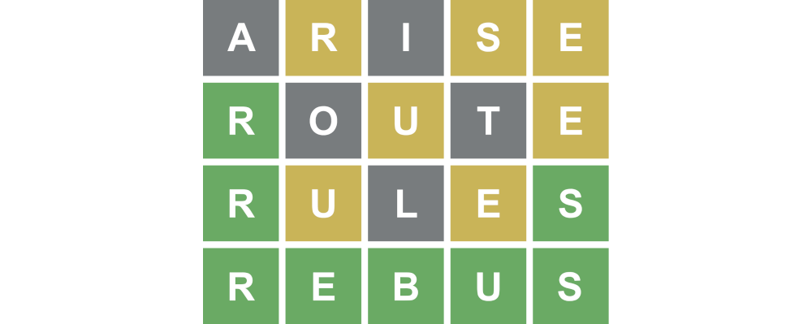

## Test d'Artisanat logiciel et qualité de développement

### Test du jeudi 9 juin 2022 – Durée 2 heures – Documents autorisés

L'objectif de cet exercice est la programmation de la logique du jeu **Wordle**.

**Wordle** est un jeu de lettres en ligne gratuit développé en 2021 par Josh Wardle. Ce jeu est une adaptation directe
du jeu télévisé américain Lingo (Motus en France) qui propose de faire deviner un mot par plusieurs tentatives, en
indiquant pour chacune d'entre-elles la position des lettres bien placées et mal placées. Par sa popularité sur Twitter,
Wordle rencontre un succès immédiat dans sa version en anglais. Il est rapidement proposé dans d’autres langues et imité
dans d'autres versions. L'originalité du jeu tient dans le fait qu'une seule énigme commune à tous les joueurs est
proposée chaque journée.



### Description du jeu

Le but du jeu est de deviner un mot spécifique de cinq lettres en un maximum de six tentatives, en tapant des lettres
sur un écran de six lignes de cinq cases chacune. La personne qui joue inscrit sur la première ligne un mot de cinq
lettres de son choix et entre sa proposition. Après chaque proposition, les lettres apparaissent en couleurs : le fond
gris représente les lettres qui ne se trouvent pas dans le mot recherché, le fond jaune représente les lettres qui se
trouvent ailleurs dans le mot, et le fond vert représente les lettres qui se trouvent à la bonne place dans le mot à
trouver. Un seul mot est proposé par jour. Il est possible de copier dans le presse-papier la grille jouée (positions
des lettres bien placées et mal placées) afin de la partager.

L'IHM pourrait ressembler à la fenêtre suivante :


### Travail à réaliser

L'objectif de ce test est d'évaluer votre capacité à écrire du code propre à l'aide du langage Java et des tests 
unitaires. Les méthodes complexes, car trop algorithmiques n'auront pas à être implémentées. Vous pourrez retrouver une 
proposition de correction à l'adresse suivante :
<https://github.com/IUTInfoAix-R202/TestIHM2022/>

La logique du jeu Wordle reposera principalement sur les trois classes suivantes :

- La classe `Word` qui permet de matérialiser un mot ainsi que toutes les fonctionnalités associées.
- La classe `Dictionary` qui permettra de disposer d'un dictionnaire pour reconnaitre les mots valides que les joueurs auront le droit d'utiliser.
- La classe `Game` qui s'occupe de mémoriser l'ensemble des essais d'un joueur et de determiner s'il a gagne ou perdu.

Votre travail dans la suite de ce sujet sera d'écrire pas à pas les classes ci-dessus.

En plus de ces classes, il existe aussi une énumération `LetterStatus` qui permet d'associer à chaque lettre un état qui sera utile pour le développement de l'IHM. 
Cette énumération vous est donnée ci-après : 
```java
package fr.univ_amu.iut.game;

public enum LetterStatus {
    EMPTY, UNLOCKED, WRONG, PRESENT, CORRECT
}
```

### Exercice 1 - Implémentation de la classe `Word`

Un mot est le concept de base du jeu Wordle. Dans la version que l'on a choisi d'implémenter, les mots ont une longueur de 5 lettres. Pour s'éviter des erreurs, les mots seront toujours mis en majuscule avec la méthode `toUpperCase()` de la classe `String`.

1. Écrire la déclaration minimale de la classe `Word` (ainsi que le constructeur et la méthode `letters()`) permettant de faire passer le test unitaire suivant : 

```java 
@Test
void testThatValidWordLettersAreValid() {
    Word wordleWord = new Word("valid");
    assertThat(wordleWord.letters()).isEqualTo(new char[]{'V', 'A', 'L', 'I', 'D'});
}
```
2. Écrire le code à rajouter au constructeur précédent pour gérer les mots n'ayant pas le bon nombre de lettres. Votre code devra permettre de faire passer les tests suivants :

```java
@Test
void testThatFewWordLettersShouldRaiseException() {
    assertThatThrownBy(() -> new Word("vali")).isInstanceOf(IllegalArgumentException.class)
            .hasMessageContaining("Too few letters. Should be 5");
}

@Test
void testThatTooManyWordLettersShouldRaiseException() {
    assertThatThrownBy(() -> new Word("toolong")).isInstanceOf(IllegalArgumentException.class).hasMessageContaining("Too many letters. Should be 5");
}
```

3. En supposant que vous disposez de la méthode `void hasOnlyValidLetters(String word)` qui s'occupe de vérifier si un mot n'est composé que de caractères alphabétiques et que l'appel à cette méthode est rajouté au constructeur, écrire les tests `testThatInvalidLettersShouldRaiseException()` et `testThatPointShouldRaiseException()`. Voici l'implémentation de la méthode `hasOnlyValidLetters` :
    ```java
    private void hasOnlyValidLetters(String word) {
        if (! word.matches("[a-zA-Z]*"))
            throw new IllegalArgumentException("word contain invalid letters");
    }
    ```
4. Écrire la méthode `List<Integer> matchesCorrectPositionWith(Word)` qui permet de connaitre les lettres bien placées dans un mot. Le mot passé en paramètre est le mot à deviner. Les tests suivants, vous montre plusieurs exemples d'utilisation de cette méthode :
```java
@Test
public void testThatTwoWordHasNoMatch() {
   Word firstWord = new Word("trees");
   Word secondWord = new Word("valid");
   assertThat(firstWord.matchesCorrectPositionWith(secondWord)).isEqualTo(List.of());
}
@Test
public void testThatMatchesFirstLetter() {
    Word firstWord = new Word("trees");
    Word secondWord = new Word("table");

    assertThat(firstWord.matchesCorrectPositionWith(secondWord)).isEqualTo(List.of(0));
}
@Test
public void testThatMatchesAllLetters() {
    Word firstWord = new Word("trees");
    Word secondWord = new Word("trees");

    assertThat(firstWord.matchesCorrectPositionWith(secondWord)).isEqualTo(List.of(0, 1, 2, 3, 4));
}
```
5. En supposant disposer de la méthode qui recherche les lettres mal placées `List<Integer>  matchesIncorrectPositionWith(Word)`, écrire la méthode de test qui compare le mot ""alarm" avec le mot "drama".

### Exercice 2 - Implémentation de la classe `Dictionary`
Le dictionnaire permet de reconnaitre un mot valide. Si un utilisateur propose un mot qui n'existe pas dans le dictionnaire, le mot ne devra pas être accepté par le jeu.

1. Écrire la déclaration minimale de la classe `Dictionary` permettant de faire passer les tests unitaires suivants :
```java
@Test
void testThatEmptyDictionaryHasNoWords() {
    Dictionary dictionary = new Dictionary();
    assertThat(dictionary.wordsCount()).isEqualTo(0);
}

@Test
void testThatSingleDictionaryReturns1AsCount() {
    Dictionary dictionary = new Dictionary(new Word("happy"));
    assertThat(dictionary.wordsCount()).isEqualTo(1);
}
```

2. Écrire la méthode `includesWord` qui vérifie si un mot est contenu dans le dictionnaire. Cette méthode doit valider les tests suivants.
```java
@Test
void testThatDictionaryDoesNotIncludeWord() {
    Dictionary dictionary = new Dictionary(new Word("happy"));
    assertThat(dictionary.includesWord(new Word("sadly"))).isFalse();
}

@Test
void testThatDictionaryIncludesWord() {
    Dictionary dictionary = new Dictionary(new Word("happy"));
    assertThat(dictionary.includesWord(new Word("happy"))).isTrue();
}
```
3. Jusqu'à présent, les dictionnaires utilisés n'avaient qu'un seul mot. Pour gérer les dictionnaires de taille arbitraires, le constructeur suivant est ajouté : 
```java
public Dictionary(Word... words) {
    this.words = words;
}
```
Écrire deux tests à ajouter à l'actuelle suite de tests pour vérifier que la classe accepte bien plusieurs mots.

### Exercice 3 - Implémentation de la classe `Game`
La classe `Game` permet de matérialiser une partie du jeu Wordle. Elle a donc la responsabilité de vérifier le respect des règles du jeu.

1. Écrire la déclaration de la classe `Game` dispose des données membres suivantes :
 - `wordsTried` du type `List<Word>` est une liste des mots essayés par le joueur.
 - `dictionary` du type `Dictionary` est le dictionnaire utilisé pour valider les mots proposés.
 - `winnerWord` du type `Word` est le mot recherché par le joueur.
2. Écrire le constructeur `public Game(Dictionary dictionary, Word winnerWord)` qui initialise les données membres. Le constructeur devra faire passer le test suivant :
```java
@Test
void testWinnerWordNotInDictionary() {
    Dictionary dictionary = new Dictionary(new Word("happy"));
    Word winnerWord = new Word("heros");
    assertThatThrownBy(() -> new Game(dictionary, winnerWord)).isInstanceOf(IllegalArgumentException.class).hasMessageContaining("Winner word must be in dictionary");
}
```
3. Écrire la méthode `hasWon()` minimale nécessaire pour valider le test suivant :
```java
@Test
void testThatEmptyGameHasNoWinner() {
    Dictionary dictionary = new Dictionary(new Word("happy"));
    Word winnerWord = new Word("happy");
    Game game = new Game(dictionary, winnerWord);
    assertThat(game.hasWon()).isFalse();
}
```
4. Écrire les méthodes nécessaires pour valider le test suivant:
```java
@Test
void testThatTryOneWordAndRecordIt() {
    Dictionary dictionary = new Dictionary(new Word("happy"), new Word("loser"));
    Word winnerWord = new Word("happy");
    Game game = new Game(dictionary, winnerWord);
    game.addtry(new Word("loser"));
    assertThat(game.wordsTried()).isEqualTo(List.of(new Word("loser")));
}
```
5. En supposant que l'on dispose de la méthode `hasLost()` qui permet de vérifier si le joueur a perdu, écrire les méthodes de tests `testThatTryFourWordsLoses()` et `testThatTryFiveWordsLoses()`. Ces deux tests permettent de vérifier les deux valeurs possibles de la méthode `hasLost()` en fonction du nombre d'essais.
6. Écrire la version complète de la méthode `hasWon()` qui valide le test suivant : 
```java
@Test
void testThatGuessesWord() {
    Dictionary dictionary = new Dictionary(new Word("happy"));
    Word winnerWord = new Word("happy");
    Game game = new Game(dictionary, winnerWord);
    assertThat(game.hasWon()).isFalse();
    game.addtry(new Word("happy"));
    assertThat(game.hasWon()).isTrue();
}
```

 


