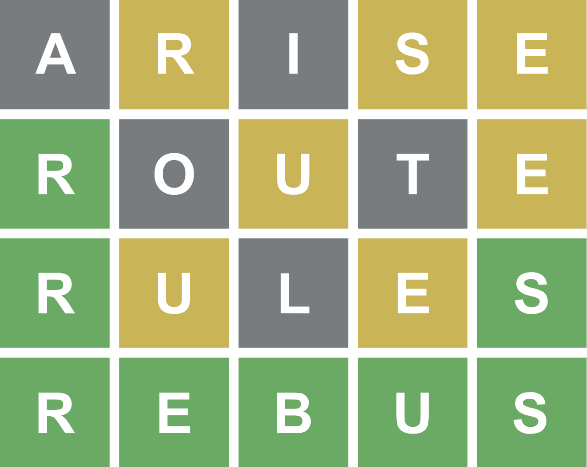

## Test d'IHM et langage Java

### Test du jeudi 9 juin 2022 – Durée 2 heures – Documents autorisés

L'objectif de cet exercice est la programmation d'une version JavaFx du jeu **Wordle**. 

**Wordle** est un jeu de lettres en ligne gratuit développé en 2021 par Josh Wardle. Ce jeu est une adaptation directe du jeu télévisé américain Lingo (Motus en France) qui propose de faire deviner un mot par plusieurs tentatives, en indiquant pour chacune d'entre-elles la position des lettres bien placées et mal placées. Par sa popularité sur Twitter, Wordle rencontre un succès immédiat dans sa version en anglais. Il est rapidement proposé dans d’autres langues et imité dans d'autres versions. L'originalité du jeu tient dans le fait qu'une seule énigme commune à tous les joueurs est proposée chaque journée.

### Description du jeu

Le but du jeu est de deviner un mot spécifique de cinq lettres en un maximum de six tentatives, en tapant des lettres sur un écran de six lignes de cinq cases chacune. La personne qui joue inscrit sur la première ligne un mot de cinq lettres de son choix et entre sa proposition. Après chaque proposition, les lettres apparaissent en couleurs : le fond gris représente les lettres qui ne se trouvent pas dans le mot recherché, le fond jaune représente les lettres qui se trouvent ailleurs dans le mot, et le fond vert représente les lettres qui se trouvent à la bonne place dans le mot à trouver. Un seul mot est proposé par jour. Il est possible de copier dans le presse-papier la grille jouée (positions des lettres bien placées et mal placées) afin de la partager.

L'IHM que vous allez en partie réaliser ressemblera aux fenêtres suivantes :

### Travail à réaliser

L'objectif de ce test est d'évaluer votre capacité à écrire une IHM à l'aide du langage Java, les méthodes complexes car trop algorithmiques n'auront pas à être implémentées. Vous pourrez retrouver une proposition de correction à l'adresse suivante : 
<https://github.com/IUTInfoAix-R202/TestIHM2022/>

L'application définit plusieurs types d'objets :
 
- Un objet `WordleMain` est une application JavaFX permettant de jouer.

Le diagramme UML suivant donne un aperçu synthétique de la structure des classes de l'application. Il n'est pas nécessaire de l'étudier pour l'instant, mais il vous sera très utile pour retrouver les données membres et méthodes des différentes classes.

Votre travail dans la suite de ce sujet sera d'écrire pas à pas plusieurs des classes ci-dessus.